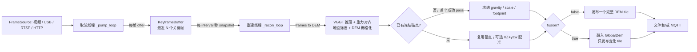
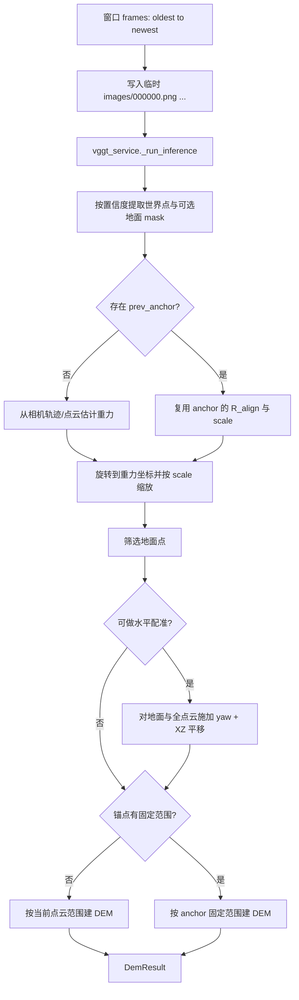

# 当前滑动窗口重建循环：结构、数据流与修改点

> 本文对应当前仓库中的流式重建实现，主实现位于：
>
> - `streaming/reconstruct_loop.py`：默认滑窗循环与发布逻辑
> - `streaming/keyframe_buffer.py`：关键帧筛选与环形窗口
> - `streaming/pipeline.py`：一次窗口重建（帧 → DEM）
> - `streaming/two_stage_loop.py`：显式启用的两阶段会话变体
>
> 这里的“滑动窗口”不是对视频的固定帧号切片；它是**最近 N 个被判定为视角变化足够大的关键帧**组成的滚动集合。

## 1. 总览

默认接口是 `POST /stream/start`，由 `streaming/endpoints.py` 创建 `ReconstructLoop` 并启动。整个运行时由两个相互独立的守护线程组成：



关键并发原则：取流不会等待 VGGT 推理，推理也不会排队积压。一次重建耗时超过 `interval` 时，下一轮只会在本轮结束后再开始；中间到来的帧只更新关键帧窗口。因此系统优先保证“最新窗口”，而不是保证每一帧都被重建。

## 2. 启动时的配置与对象关系

`StreamStartRequest`（`streaming/endpoints.py`）被转换为 `LoopConfig`，然后创建：

```text
FrameSource
  + ElevationPublisher（file_out 和/或 MQTT）
  + ReconstructLoop(source, publisher, config)
      + KeyframeBuffer(capacity, sim_thresh)
      + _pump_thread
      + _recon_thread（capture_only=false 时才创建）
      + _anchor（初始为 None）
      + _gdem（fusion=true 时按需创建）
```

默认关键参数如下：

| 参数 | 默认值 | 作用 | 修改时的直接影响 |
| --- | ---: | --- | --- |
| `target_fps` | 3.0 | 取流线程向缓冲区提交帧的目标频率 | 更高会增加 ORB 计算，不保证更多关键帧 |
| `sim_thresh` | 0.92 | 关键帧保留阈值 | 值更高会保留更多帧；值更低会更稀疏 |
| `capacity` | 12 | 窗口最多保留的关键帧数 N | 满时新关键帧会挤掉最旧关键帧 |
| `min_frames` | 4 | 一次推理的最少关键帧数 | 未达到时不重建 |
| `interval` | 6.0 s | 两次“尝试重建”的最小间隔 | 不等于固定发布时间间隔，推理慢时会延后 |
| `freeze_anchor` | true | 首次成功后冻结参考坐标框架 | 关闭后各窗口会独立估计坐标与范围 |
| `registration` | true | 后续窗口对参考地面做水平配准 | 仅在已有锚点参考地面时生效 |
| `fusion` | false | 是否将各 pass 融入持续全局 DEM | 关闭为单 tile 覆盖发布；开启为多 tile 增量发布 |

`capture_only=true` 是取流诊断模式：只运行取流线程，不启动 `_recon_loop`，不会调用 VGGT。

## 3. 取流线程：帧如何进入滑窗

入口为 `ReconstructLoop._pump_loop()`：

```python
for frame in self.source.frames():
    if self._stop.is_set():
        break
    self.buffer.offer(frame)
```

`FrameSource.frames()` 产出 RGB ndarray。每个帧均交给 `KeyframeBuffer.offer(frame)`，但并非每帧都会进入窗口。

### 3.1 关键帧判定

`KeyframeBuffer` 使用与离线路径一致的 ORB 视角相似度度量：

1. 转灰度；若宽度超过 320 px，则等比例缩小到 320 px。
2. 用 ORB 提取最多 1500 个特征与描述子。
3. 与**上一个被保留的关键帧**进行 Hamming BFMatcher 的 KNN 匹配。
4. 通过 ratio test（0.75）筛选匹配，并用 RANSAC（阈值 4.0）估计单应性。
5. 相似度计算为：

   ```text
   similarity = RANSAC 内点比例 × 1 / (1 + (parallax / diag / 0.06)^2)
   ```

   其中 `parallax` 是内点像素位移中位数，`diag` 是缩放后图像对角线长度。

6. `similarity < sim_thresh` 时保留；否则跳过。首帧无参考，始终保留。

几个容易误解的点：

- 相似度越接近 1，表示越像同一视角；缺少特征、匹配不足或单应性失败时返回 0，因而会被保留。
- 比较对象是“最后一个保留帧”，不是窗口中第一帧，也不是前一张输入帧。
- `sim_thresh` 越大，`similarity < threshold` 越容易成立，所以会保留**更多**帧。
- 接近静止的相机会持续跳过帧，窗口可能长期不足 `min_frames`；这是当前设计预期，而非重建线程故障。

### 3.2 环形窗口如何滑动

底层容器为 `deque(maxlen=capacity)`，窗口顺序始终为“最旧 → 最新”。每接受一个关键帧：

```text
窗口未满： append(新关键帧)
窗口已满： deque 自动弹出最旧帧，再 append(新关键帧)
```

例如 `capacity=4`：

```text
保留 k1 -> [k1]
保留 k2 -> [k1, k2]
保留 k3 -> [k1, k2, k3]
保留 k4 -> [k1, k2, k3, k4]
保留 k5 -> [k2, k3, k4, k5]   # k1 被淘汰
```

注意：`_last_sig` **不会**随着最旧帧淘汰而改变，它始终是最近一次保留的关键帧签名。因此淘汰只决定推理输入，不改变下一帧与哪个参考帧比较。

### 3.3 线程安全边界

`offer()` 与 `snapshot()` 都持有同一个锁。`snapshot()` 返回的是当前 `deque` 的浅拷贝列表：

- 正在推理的 `frames` 列表不会因之后的滑窗移动而改变；
- 图像 ndarray 本身没有复制，当前实现假定 `FrameSource` 不会在产出后原地修改该 ndarray；
- ORB 特征提取目前发生在 `offer()` 内、获取锁之前，因此相似度计算不会长时间阻塞 `snapshot()`。

## 4. 重建调度循环：何时真正跑一次 VGGT

入口为 `ReconstructLoop._recon_loop()`。简化后的控制流：

```python
while not stop:
    if stop.wait(interval):
        break

    kept = buffer.stats.kept
    frames = buffer.snapshot()
    if len(frames) < min_frames or kept <= last_reconstructed_kept:
        continue

    result = reconstruct_frames_to_dem(frames, prev_anchor=anchor, ...)
    if freeze_anchor and anchor is None:
        anchor = Anchor.from_result(result)
    publish(result)
    last_reconstructed_kept = kept
```

它有三个门槛：

1. **时间门槛**：线程启动后先等待完整的 `interval`；不是立即重建。
2. **数量门槛**：快照中的关键帧数必须不少于 `min_frames`。
3. **新数据门槛**：全局累计 `kept` 必须大于 `_last_reconstructed_kept`。这避免同一个窗口在没有新关键帧时每隔 `interval` 被重复推理。

这里的“新数据”只表示至少新接受了一个关键帧，不表示快照内容完全不同。窗口已满后只要接收一个新关键帧，就会以“去掉最旧帧、加入最新帧”的窗口运行一次。

### 4.1 推理超时的实际行为

当前没有任务队列，也没有“如果上一轮未结束就跳过一个独立定时 tick”的调度器。重建函数为同步调用：

```text
等待 interval → 同步跑当前窗口 → 发布 → 再等待 interval
```

因此一轮总周期约为：`实际重建耗时 + interval`。重建过程中取流线程仍持续推进窗口；推理完成后，下一次快照会直接取当时最新的窗口。不会补跑推理期间的旧窗口。

### 4.2 成功与失败后的状态更新

成功后才会更新：

- `passes`、`last_pass_seconds`；
- 重力来源、配准状态及误差；
- `_last_reconstructed_kept`；
- 发布数与高程范围。

如果重建或发布抛异常，只写入 `last_error`，并且**不更新** `_last_reconstructed_kept`。下一次 interval 会对当时窗口再次尝试；如果没有新关键帧，仍会重试同一窗口。这是当前失败恢复策略。

视频文件在非循环模式下读完时，取流线程退出，但重建线程不会自动退出；它会保留最后的窗口，若已重建则因“新数据门槛”持续跳过，直到调用 `/stream/stop`。

## 5. 单次窗口重建：`frames → DemResult`

`pipeline.reconstruct_frames_to_dem()` 以某一时刻取得的窗口快照为输入。它复用离线实现，流程如下：



详细步骤：

1. 将内存帧写入临时目录 `images/000000.png`、`000001.png`……，以保证文件排序与捕获顺序一致。
2. 调用现有的 `vggt_service._run_inference()`；这是为了保持与离线 `/fit_elevation` 路径一致，而非在流式模块重新实现预处理或推理。
3. 通过 `_extract_points_with_conf()` 用置信度阈值筛选点。默认 `conf_thres=50.0`（百分位门槛）；没有存活点则本 pass 失败。
4. 若无锚点，`estimate_gravity()` 估计重力旋转 `R_align`；若有锚点，则直接采用首次成功 pass 的 `R_align` 与 `scale_factor`，重力来源记录为 `anchor`。
5. 用 `apply_alignment_to_points()` 旋转点云，并乘以尺度。对齐后的约定是 `Y=向上/高程`，DEM 行为 Z，列为 X。
6. `_select_ground_aligned()` 从对齐点中选出地面候选；少于 3 个点时失败。
7. 若 `prev_anchor.ref_ground_xyz` 存在且 `register=true`，以 `register_horizontal()` 估计相对参考地面的水平 yaw 与 XZ 平移。收敛时该变换同时作用于地面点和全点云；失败则保留锚点坐标框架但不施加该变换，并在 `warnings` 留痕。
8. 建 DEM：有锚点固定范围时，在冻结的 `(x_bounds, z_bounds)` 上插值；否则按当前点云范围调用离线相同的网格构建逻辑。线性插值为空的区域用最近邻填补，`has_data` 只标记原始线性插值有效格。
9. 返回 `DemResult`，内含 DEM、有效格掩码、范围、地面点、配准质量和警告。

临时目录只覆盖一次调用，在函数返回后由 `TemporaryDirectory` 自动清理。`save_glb=true` 时，原始 VGGT 点云会在清理前另行导出为 `pass_XXXX.glb`；该诊断输出不影响 DEM。

## 6. 首帧锚定与后续窗口坐标稳定性

默认 `freeze_anchor=true`。**第一个成功的重建 pass** 发布前创建 `Anchor`，冻结：

- `R_align`：VGGT 世界坐标到重力坐标的旋转；
- `scale_factor`：对齐单位到米的比例；
- `x_bounds`、`z_bounds`：DEM 的平面范围；
- `ref_ground_xyz`：参考地面点（仅 `registration=true` 时保存）。

后续 pass 将复用前 3 项，避免每个滑窗各自估计重力、尺度和 DEM 足迹，导致 Unity 中 tile 翻转、缩放或平移。

但 VGGT 每个窗口仍可能有水平方向的原点和朝向漂移，因此可选的 M4.2 配准只估计：

```text
绕 Y 轴旋转（yaw） + XZ 平移
```

它不会再次改变重力方向、Y 高程尺度或锚点范围。注册收敛情况、RMSE 和 yaw 会写入 `/stream/status` 的 `last_registered`、`last_reg_rmse`、`last_reg_yaw_deg`。

### 关闭锚定时的含义

若 `freeze_anchor=false`，`_anchor` 永远不创建，因而：

- 每次窗口独立估计重力和使用请求的 `scale_factor`；
- 每次窗口根据自身点云重算 DEM 范围；
- 水平配准没有参考地面，实际不会生效；
- `fusion=true` 时全局 DEM 仍会创建，但其原点取第一次融合结果的中心，后续独立窗口的漂移风险更高。

## 7. 发布分支

### 7.1 默认：单 tile 覆盖发布（`fusion=false`）

`_publish_single_tile()` 将当前 `DemResult` 转换为 ElevationMsg，然后通过所有已配置通道发布：

```text
当前窗口 DEM → dem_result_to_msg → publisher.publish(msg)
```

默认 tile 坐标是 `(tile_x=0, tile_y=0)`。每个成功 pass 都发布一次，新的消息代表当前滑窗重建结果；它不是跨 pass 的高度融合。

### 7.2 可选：持续全局融合（`fusion=true`）

`_publish_fusion()` 首次使用时创建 `GlobalDem`。其中心优先取 anchor 固定范围中心；没有 anchor 时取当前 pass 范围中心。之后每一 pass：

1. 将 `res.ground_xyz` 融入全局网格；
2. 采用 `fusion_decay` 使旧观测权重衰减；
3. 对每格使用 `top_percentile` 高程统计；
4. 找出相对上次已发布内容变化超过 `change_thresh` 的 tile；
5. 只发布这些变化 tile。

此模式里一次重建可能发布 0、1 或多个 tile，`published` 计数的是消息数而非重建次数。`observed_cells`、`tiles_published_total` 和 `last_changed_tiles` 可从状态接口查看。

## 8. 两阶段会话模式：和默认滑窗的区别

`/session/*` 入口创建的是 `TwoStageReconstructLoop`，它继承默认循环但重写 `_recon_loop()`。这是一个显式选择的工作流，不是普通 `/stream/start` 的默认行为。

| 模式 | 入口 | 滑窗行为 | 成功后的处理 |
| --- | --- | --- | --- |
| 默认流式 | `/stream/start` | 持续运行；每次有新关键帧且到 interval 时重建 | 直接单 tile 发布或融合发布 |
| 初始化 | `/session/initialize` | `min_frames` 被设为 `initialization_frames`，收集到足够关键帧后重建一次 | `stage_initial_map` 质检、保存会话数据，随后自动停止采集 |
| 增量更新 | `/session/update` | 持续滑窗，强制 anchor、registration 和 fusion 开启 | 先做变化可信度门控，只有接受的变化才融合、发布并持久化 |

增量更新与默认 `fusion=true` 的关键差异是：它会在发布前调用 `assess_change()`。被拒绝的窗口不融合也不发布；连续拒绝会使会话转为 `DEGRADED` 或 `REINIT_REQUIRED` 并停止循环。接受且实际存在变化时，才写入 DEM、全局融合状态和新的 map version。

## 9. 状态、停止和异常

`GET /stream/status` 的几个字段可用于判断循环停在哪一层：

| 现象 | 应优先查看 | 常见含义 |
| --- | --- | --- |
| `offered` 增长，`kept` 不增长 | `sim_thresh`、相机视差 | 所有新帧被判为过于相似 |
| `kept` 增长，`passes` 不增长 | `window`、`min_frames`、`last_error` | 可能尚未到间隔、关键帧数不足或上一轮失败 |
| `passes` 增长，`published` 不增长 | fusion 状态、`last_changed_tiles` | 融合模式下没有 tile 达到变化阈值，或 pass 无地面点 |
| `anchor_frozen=false` | `last_error` | 尚无首次成功重建 |
| `last_registered=false` | `last_reg_rmse`、warning | 无参考地面、关闭 registration 或配准未收敛 |

`POST /stream/stop` 的顺序为：设置停止事件 → 尝试关闭 source → join 重建/取流线程（每线程最多等 `join_timeout`）→ 关闭 publisher → 标记状态为不运行。线程均为 daemon；停止主要依赖 `FrameSource.close()` 或 `Event.wait()` 尽快解除阻塞。

## 10. 修改时最重要的切入点

| 想改什么 | 首选位置 | 需要同步注意 |
| --- | --- | --- |
| 改关键帧质量/视差策略 | `KeyframeBuffer.offer`、`_frame_similarity` | 保持 `BufferStats` 语义；确认不让 ORB 计算阻塞取流过久 |
| 改窗口策略（例如时间窗、按覆盖率淘汰） | `KeyframeBuffer` | `snapshot()` 必须继续提供稳定的 oldest→newest 序列 |
| 改“何时重建” | `ReconstructLoop._recon_loop` | 保持 `_last_reconstructed_kept` 的成功后更新语义，避免无新帧反复推理 |
| 改单次重建/DEM算法 | `pipeline.reconstruct_frames_to_dem` | 当前代码刻意复用离线流程；若改变，应确认离线与流式是否仍需一致 |
| 改坐标稳定策略 | `Anchor`、`registration.py`、`pipeline.py` | 要区分重力/尺度/固定范围（M4.1）与 yaw/XZ 配准（M4.2） |
| 改发布编码或下游协议 | `dem_result_to_msg`、`elevation_export.py`、`ElevationPublisher` | 单 tile 和 fusion 两条发布路径都需验证 |
| 改多窗口融合规则 | `global_dem.py` 与 `_publish_fusion` | 注意 `change_thresh` 同时影响重发频率与下游可见更新 |
| 改两阶段的可信更新策略 | `TwoStageReconstructLoop._handle_update`、`change_detection.py` | 不要绕过拒绝计数、状态迁移和持久化 |

## 11. 当前实现的边界与改动风险

1. 每个 pass 都将窗口帧写成临时 PNG 后再推理；这是为了复用既有 VGGT 加载器。改成直接内存输入会提高效率，但需要验证预处理与离线路径完全等价。
2. 窗口以“关键帧个数”限长，而非真实时间跨度或基线覆盖度；在相机速度变化很大时，12 个关键帧的实际时间范围会不稳定。
3. `_last_reconstructed_kept` 只用累计关键帧计数判断是否更新；当前窗口身份没有哈希或版本号。只要有一帧新 keyframe 就会重建，而失败则会持续重试。
4. 锚点由首个成功 pass 决定，其质量对整个会话十分关键；默认循环本身没有首帧质量审核。需要受控初始化与人工确认时，应使用 `/session/initialize` 工作流。
5. `has_data` 仅表示线性插值有真实支撑；DEM 的 NaN 空洞会以最近邻填充。下游若要区分真实观测和补全区域，必须使用 `has_data`，不要只看 `elev`。
6. 同一时刻只允许一个全局 `_loop` 运行；不同流不能并发服务于默认 API。

## 12. 一次典型运行时间线

以默认配置为例：

```text
t=0s    start(): 取流线程与重建线程启动
t=0~6s  取流线程持续 offer；满足视差的帧进入 [k1, k2, ...]
t=6s    重建线程 snapshot；若至少 4 个 keyframe，开始 pass 1
t≈6s+P  pass 1 完成：冻结 anchor，发布当前 DEM
t≈12s+P 下一轮检查：若期间有新 keyframe，使用更新后的最近至多 12 帧开始 pass 2
...
```

其中 `P` 是实际推理、点云处理和发布耗时。若在 `t=6s` 只有 3 个关键帧，循环不推理，下一次检查在 `t=12s`；若相机始终没有产生足够视差，则会持续跳过。
