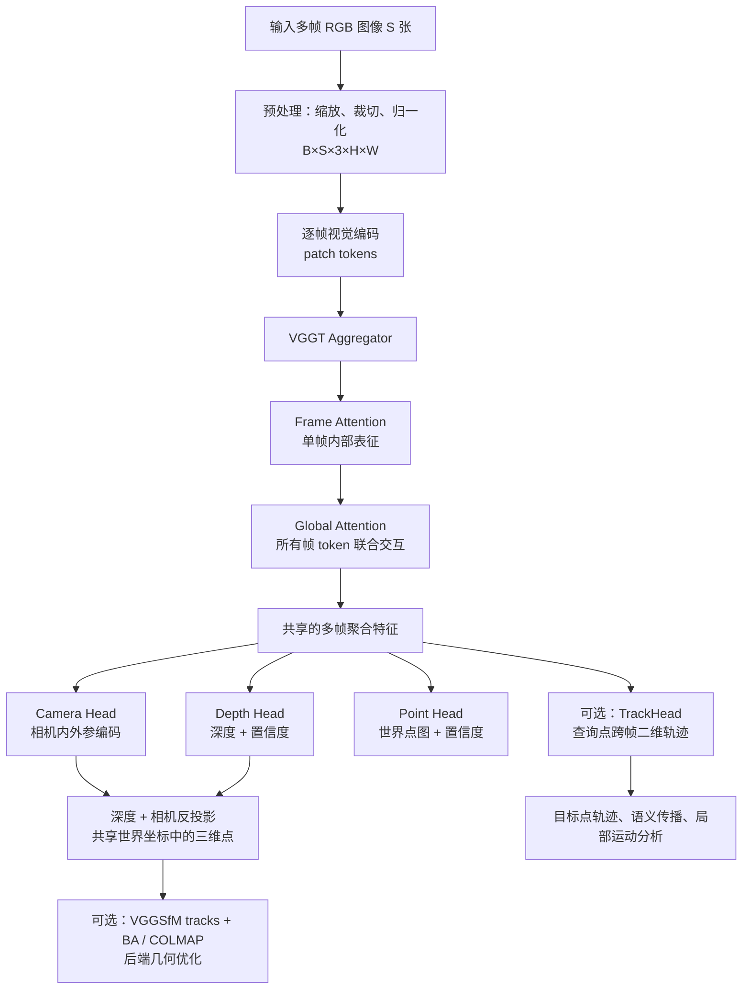

# VGGT 中的跨帧对齐策略及其与模型架构的关系

## 结论先行

VGGT 的常规三维重建并不以传统的“特征匹配 → RANSAC → SfM”作为前置流程。它把一组图像作为一个整体送入 Transformer，通过跨帧全局注意力在**特征层隐式对齐**多个视角，然后并行预测相机、深度和点图。

原生代码还提供两种显式二维对应能力：

1. **VGGT `TrackHead`**：模型内部的可选分支。给定输入序列第 0 帧的像素查询点，预测这些点在全部帧的二维轨迹、可见性和置信度。
2. **`dependency/` 中的 VGGSfM tracker**：仓库附带的独立工具链。它自动选取大量特征点并跟踪，主要用于 COLMAP / Bundle Adjustment（BA）示例，不属于 VGGT 主模型常规前向路径。

因此，“对齐”在 VGGT 中不是单一算法，而是三个层次：**特征对齐、几何对齐、可选的显式像素对齐/后端优化**。

---

## 1. 完整数据流与对齐发生的位置



VGGT 的主输出是 `Camera Head`、`Depth Head` 和 `Point Head`。`TrackHead` 与它们共享 backbone 的多帧特征，但不是三维重建必须经过的步骤，也不会把轨迹结果反馈给相机、深度或点图 head。

## 2. 第一层：特征层的隐式跨帧对齐

### 2.1 输入环境：离线多视图窗口

VGGT 的一个推理样本是完整图像序列，而不是“当前帧 + 上一帧”。输入张量逻辑形状为：

```python
images.shape == (B, S, 3, H, W)
```

- `B`：batch size；
- `S`：本次共同推理的图像帧数；
- `H, W`：预处理后的图像尺寸。

所以它是**非因果（non-causal）**的多帧模型：预测第 0 帧时可以利用第 1 到第 `S-1` 帧的信息。它不是只保存上一帧状态、逐帧向前运行的传统在线 tracker。

### 2.2 Aggregator 的交替注意力

每帧先编码为 patch token。随后 `Aggregator` 对 token 交替执行：

1. **Frame Attention**：各帧单独处理，建模本帧局部外观和几何线索；
2. **Global Attention**：将所有帧的 token 合并，让不同帧的空间位置和语义区域直接交互。

因此，经过 global attention 后，一帧中的 token 已经包含其他视角对该区域的支持或修正。Camera/Depth/Point 三个 head 都建立在这批共享特征之上。

这就是 VGGT 最核心、也是默认始终存在的跨帧“对齐”：它是**隐式的特征融合**，不导出关键点对、描述子匹配列表或匹配矩阵。

### 2.3 它如何服务于三维几何

基于聚合特征，VGGT 并行预测：

| 分支 | 输出 | 与跨帧对齐的关系 |
|---|---|---|
| Camera Head | 每帧相机位姿和内参编码 | 通过多视图上下文估计相机间关系 |
| Depth Head | 每帧深度和置信度 | 利用其他视角降低单帧深度歧义 |
| Point Head | 每帧世界坐标点图和置信度 | 直接回归共享世界系中的稠密三维点 |

随后可将深度与相机参数反投影为三维点。这是模型输出的**几何层对齐**：不同帧的点被预测到同一世界坐标系。

注意：此过程不是显式求解的 SfM/BA。相机、深度和点图均由网络前馈预测，几何一致性来自训练所得的多视图表征和预测头，而非运行时的显式最小二乘优化。

---

## 3. 第二层：VGGT TrackHead 的显式二维对齐

### 3.1 在架构中的位置

`TrackHead` 是 VGGT 模型的一部分，读取和 Camera/Depth/Point head 相同的 `aggregated_tokens_list`。但只有调用者传入 `query_points` 时才运行。

```python
predictions = model(images, query_points=query_points)

# 额外出现的输出
predictions["track"]  # B×S×N×2
predictions["vis"]    # B×S×N
predictions["conf"]   # B×S×N
```

`query_points` 是像素坐标，形状为 `N×2` 或 `B×N×2`。

### 3.2 它解决的问题

TrackHead 回答的是：

> 输入序列第 0 帧中的这个像素点，在序列的每一张图像里对应在哪里？

它的输出是**二维像素轨迹**，不是三维轨迹，也不是任意两帧之间的全图匹配矩阵。

```text
第 0 帧查询点 p = (x, y)
        ↓
track[0] = p                    # 参考帧坐标固定
track[1], track[2], ...         # 各帧预测的对应像素
vis[s], conf[s]                 # 点在第 s 帧是否可见、是否可靠
```

### 3.3 内部匹配逻辑

1. **多帧特征解码**：TrackHead 先将 Aggregator 的多层 token 经 DPT 解码为每帧 feature map。这些 feature map 已经包含 global attention 的跨帧上下文。
2. **提取参考点特征**：从第 0 帧的 feature map 在查询坐标处采样点特征。
3. **全帧初始化**：先将所有帧中的候选位置初始化为查询点坐标。
4. **局部相关性搜索**：在各帧当前候选坐标附近构建多尺度相关性金字塔，计算参考点轨迹特征与局部图像特征的相似性。
5. **联合迭代更新**：将相关性、当前位移、轨迹特征及位置编码输入 UpdateFormer；它沿时间维度融合同一轨迹在所有帧的信息，也在不同查询点之间交换信息。
6. **输出位置增量**：默认反复更新 4 次，得到每帧坐标；随后预测 `vis`、`conf`。

这是一种学习式、查询点驱动的轨迹回归。它不使用运行时的 descriptor 最近邻、Lowe ratio test、RANSAC 或硬性一对一约束。

### 3.4 第 0 帧参考约束及其影响

原生实现固定从 `fmaps[:, 0]` 提取查询点特征，并在每次更新后把 `coords[:, 0]` 强制还原为原查询坐标。因此第 0 帧是 reference frame。

这有两个后果：

- 单次前向最自然的任务是“第 0 帧指定点 → 全部帧”；
- 若希望以第 `k` 帧为参考，需要把该帧重排到序列首位，推理后再还原输出顺序。

官方 COLMAP demo 也指出：针对多个参考帧使用 VGGT TrackHead 时，需要多次运行 backbone；这是该版本效率上的限制。

### 3.5 TrackHead 与几何输出的关系

TrackHead 不直接使用 Camera Head 输出的位姿或 Depth Head 输出的深度；它主要依赖共享的多帧视觉特征与局部 correlation。

但在下游可以将它们结合：

```text
二维 track[s, n]
    + 第 s 帧的 depth / world_points
    → 该轨迹点的三维位置候选
    + vis / conf 过滤
    → 稳健的局部三维轨迹或跨帧一致性约束
```

这很适合目标区域的点跟踪、语义 mask 传播、局部动态分析；对于遮挡、无纹理、强反光或快速运动，应额外进行可信度和几何一致性筛选。

---

## 4. 第三层：仓库附带的 VGGSfM tracker 与 BA

### 4.1 它在哪里

VGGSfM tracker 位于 `vggt/dependency/`，由 `track_predict.py` 封装。它不在 `VGGT.forward()` 中，不会随普通 `model(images)` 自动执行。

其典型流程为：

```text
多个查询帧
→ ALIKED + SuperPoint 自动检测特征点
→ VGGSfM coarse tracker
→ 可选 fine tracker
→ 大量多帧二维 tracks
→ COLMAP / Bundle Adjustment
```

它被原生 `demo_colmap.py` 用于生成适合 BA 的 tracks。官方代码明确写明，在这个 demo 中使用 VGGSfM tracker 而不是 VGGT tracker，是为了避免多参考帧时反复运行 VGGT backbone 的成本。

### 4.2 它与主模型的边界

| 项目 | VGGT 主模型 | VGGSfM tracker |
|---|---|---|
| 代码位置 | `vggt/models/`、`vggt/heads/` | `vggt/dependency/` |
| 是否进入 `VGGT.forward()` | 是（TrackHead 仅在给 query 时执行） | 否 |
| 点来源 | 外部指定 query points | 自动关键点检测 |
| 主要用途 | 指定 ROI/点的跨帧轨迹 | 大量 tracks、BA/COLMAP |
| 是否为常规重建必需 | 否 | 否 |

所以它是仓库原生附带的工程能力，但从常规 VGGT 重建架构看属于外部后端工具，而不是模型主干的一部分。

---

## 5. 三种“对齐”的职责边界

| 对齐层次 | 发生位置 | 对齐对象 | 是否默认运行 | 主要输出 |
|---|---|---|---:|---|
| 特征对齐 | Aggregator global attention | 各帧 token / 视觉语义 | 是 | 聚合特征（内部） |
| 几何对齐 | Camera/Depth/Point heads | 多帧到共享世界系 | 是 | 位姿、深度、点图 |
| 像素对齐 | VGGT TrackHead | 参考帧查询点到各帧像素 | 否 | `track`、`vis`、`conf` |
| 后端几何优化 | VGGSfM tracks + BA/COLMAP | 相机与稀疏三维点 | 否 | 优化后的几何/重建 |

一个常见误解是把 TrackHead 当作“VGGT 进行三维重建所必需的匹配前端”。实际不是：VGGT 能不显式输出 tracks 而直接做多视图重建；TrackHead 是把内部多帧表征转换为可消费的二维对应结果。

---

## 6. 对当前工程的含义

当前 `vggt_service.py` 的常规推理为：

```text
图像窗口
→ model(images)
→ 相机 / 深度 / 点图
→ 深度反投影到点云
→ 重力对齐、语义、DEM 等下游处理
```

它没有传入 `query_points`，因此没有执行 VGGT TrackHead；也没有调用 `dependency/track_predict.py`，因此没有运行 VGGSfM tracker。

若需要把原生跨帧对齐能力接入现有工作流，优先选择 TrackHead：

```text
首帧的目标 mask / 目标框
→ 在目标区域采样 64–128 个候选点
→ VGGT TrackHead
→ 用 vis/conf 筛选轨迹
→ 在各帧 depth 或 world_points 上采样三维点
→ 目标局部三维运动、跨帧语义传播或一致性验证
```

对于需要自动建立大量跨多参考帧轨迹、并进一步做 BA 的任务，再考虑原生 VGGSfM tracker。

## 7. 复用与修改原则

### 可以直接复用的部分

- 在 VGGT 推理中增加 `query_points`，获得原生 TrackHead 输出；
- 在目标 ROI 或语义 mask 内采样点；
- 依据 `vis` 和 `conf` 筛选；
- 对同一目标的多个点取中位数轨迹，避免单点误跟踪；
- 将二维轨迹回采样至深度/点图，形成三维轨迹候选。

### 可以修改但必须验证的部分

- 将任意参考帧重排到第 0 位；
- 为 `VGGSfM tracker` 补充基于 mask 的特征点筛选；其 `masks` 参数在当前实现中尚未真正用于选点；
- 依据任务调整采样点数量和 ROI 大小；
- 增加前后向一致性、重投影误差或三维邻域一致性作为二次筛选。

### 不宜直接改动的部分

- `corr_levels`、`corr_radius`、latent dimension 等 TrackHead 内部结构：它们改变相关性 MLP 的输入形状，与预训练权重不兼容，通常需要重新训练或微调；
- 直接将第 0 帧参考假设替换为任意帧：原模型训练和实现均围绕第 0 帧查询建立，重排输入更稳妥；
- 将 `vis/conf` 当作严格几何真值：它们是模型预测，应与任务相关的几何检查结合使用。

## 8. 关键源码入口

- VGGT 模型与 TrackHead 触发条件：`/home/maomaoyu/WS/vggt/vggt/models/vggt.py`
- 多帧 Frame / Global Attention：`/home/maomaoyu/WS/vggt/vggt/models/aggregator.py`
- TrackHead：`/home/maomaoyu/WS/vggt/vggt/heads/track_head.py`
- 轨迹相关性和迭代更新：`/home/maomaoyu/WS/vggt/vggt/heads/track_modules/base_track_predictor.py`
- Correlation pyramid / UpdateFormer：`/home/maomaoyu/WS/vggt/vggt/heads/track_modules/blocks.py`
- 自动 tracks 的 VGGSfM 封装：`/home/maomaoyu/WS/vggt/vggt/dependency/track_predict.py`
- 使用 VGGSfM + BA 的官方 demo：`/home/maomaoyu/WS/vggt/demo_colmap.py`

